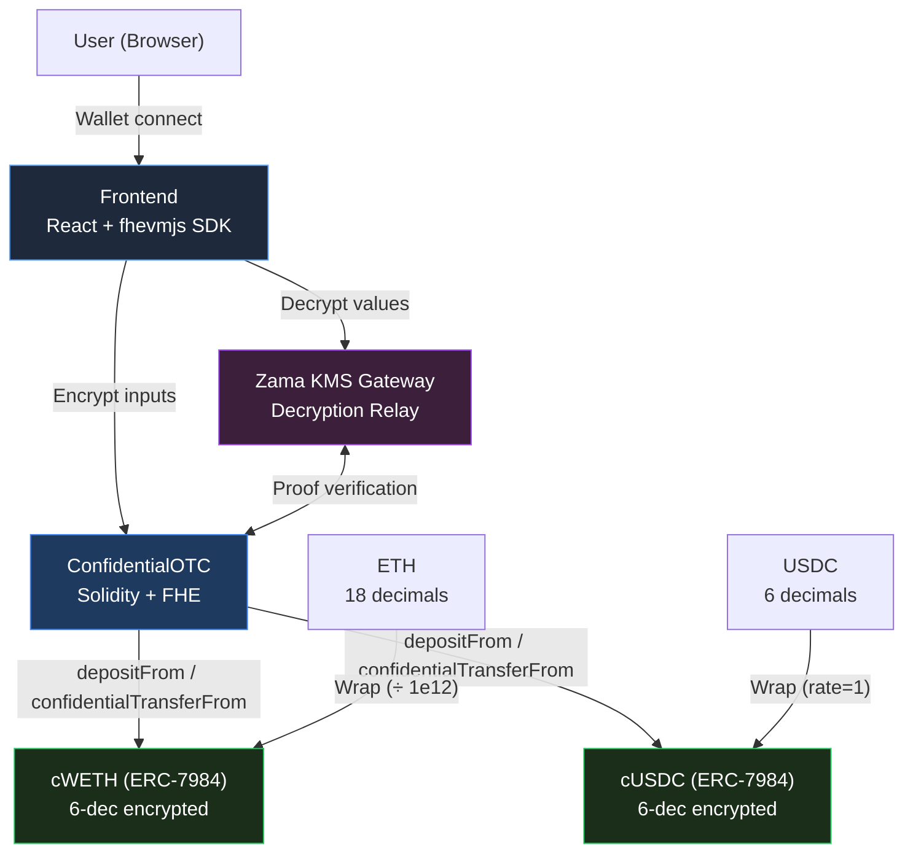
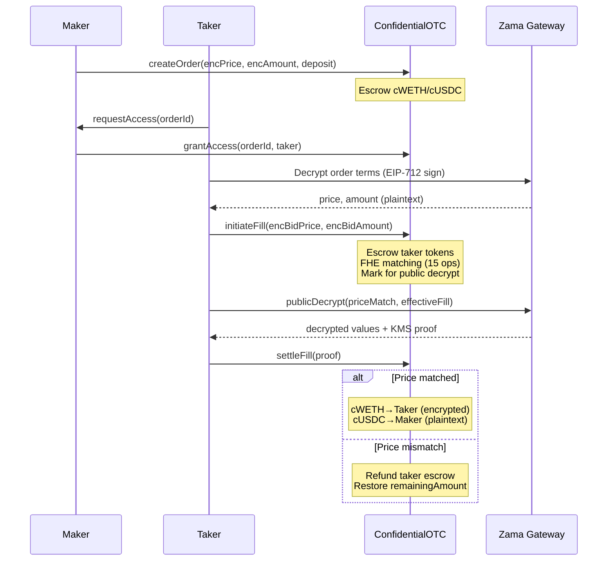

# ShadowOTC - Confidential OTC Dark Pool

Private over-the-counter trading powered by Fully Homomorphic Encryption (FHE) on Zama's fhEVM. All prices, amounts, and counterparty identities are encrypted on-chain -- no one (not even validators) can see your trading data.

## Problem

OTC trading on public blockchains exposes prices, amounts, and counterparties to everyone. This transparency creates serious risks:

- **Front-running**: MEV bots detect large orders in the mempool and trade ahead of them
- **Information leakage**: Competitors see your trading strategy, position sizes, and price levels in real time
- **Market impact**: Visible large orders move prices before execution completes
- **Counterparty exposure**: On-chain observers can link trading addresses and build profiles

Traditional privacy approaches (mixers, ZK-proofs, TEEs) either break composability, require trusted hardware, or only hide the sender -- not the trade details.

## Solution

ShadowOTC uses FHE-encrypted price matching with two-phase settlement to keep every aspect of a trade confidential while still settling trustlessly on-chain.

- Prices and amounts are encrypted as `euint64` values -- the contract operates on ciphertext, never plaintext
- Counterparty addresses are stored as `eaddress` for full privacy
- ACL-gated decryption lets makers selectively reveal terms to potential takers
- Confidential wrapper tokens (cWETH, cUSDC) built on ERC-7984 enable encrypted escrow and transfers

## Architecture



### Trade Flow



### Unified 6-Decimal FHE Precision

All encrypted balances and FHE computations use **6-decimal precision**, matching `FHE_DECIMALS = 6`. This ensures encrypted amounts and token balances are always in the same scale -- no conversion needed during settlement.

| Token | Native Decimals | Encrypted Decimals | Conversion Rate |
|-------|----------------|-------------------|-----------------|
| cWETH | 18 (wei) | 6 | RATE = 10^12 |
| cUSDC | 6 | 6 | rate() = 1 |

- **cWETH**: Custom contract with `RATE = 1e12`. Wrap requires amounts to be multiples of 1e12 wei (max 6 decimal places of ETH).
- **cUSDC**: OpenZeppelin `ERC7984ERC20Wrapper` with `rate() = 1`. Native 6-decimal USDC maps 1:1 to encrypted precision.

### Contract Architecture

```
contracts/
  ConfidentialOTC.sol   -- Main OTC contract: orders, fills, settlement
  ConfidentialWETH.sol  -- cWETH: ETH wrapper with 6-decimal encrypted precision
  ConfidentialUSDC.sol  -- cUSDC: USDC wrapper (ERC7984ERC20Wrapper, rate=1)
```

**ConfidentialOTC** manages the full trade lifecycle:
- **Order creation**: Maker deposits cWETH (SELL) or cUSDC (BUY) as escrow, encrypted price and amount stored on-chain
- **Access control**: ACL-gated decryption -- makers grant view access to specific takers
- **Fill initiation**: Taker escrows payment tokens, FHE price matching runs on-chain (15 operations)
- **Settlement**: Gateway decrypts match result, contract executes or cancels the trade

### Frontend Architecture

```
frontend/src/
  lib/
    contract.ts   -- All contract interactions, event scanning, shared helpers
    fhevm.ts      -- FHE SDK wrapper: encrypt, decrypt, Gateway relay
    abi.json      -- ConfidentialOTC ABI
    cweth-abi.json / cusdc-abi.json
  pages/
    OrderBook.tsx   -- Browse all orders, navigate to detail
    OrderDetail.tsx -- View/decrypt/fill orders, manage access
    CreateOrder.tsx -- Create encrypted orders with balance check
    MyTrades.tsx    -- View maker & taker positions
    Vault.tsx       -- Wrap/unwrap tokens, decrypt balances, transfer history
  components/
    TransactionModal.tsx -- Multi-step progress modal with CSS animations
```

## FHE Operations (17-18 total)

ShadowOTC exercises a wide range of fhEVM operations across the fill lifecycle:

| Operation | Count | Purpose |
|-----------|-------|---------|
| `FHE.ge` | 1 | Price comparison: taker price >= maker price |
| `FHE.min` | 1 | Cap fill amount to remaining order amount |
| `FHE.sub` | 1 | Reduce remaining amount after fill |
| `FHE.mul` | 2 | Compute settlement total + consistency check |
| `FHE.div` | 1 | Scale BUY order settlementTotal from 12-dec to 6-dec |
| `FHE.add` | 1 | Accumulate total encrypted volume |
| `FHE.select` | 2 | Conditionally zero out amounts on price mismatch |
| `FHE.randEuint64` | 1 | Fair tiebreaking via on-chain FHE randomness |
| `FHE.eq` | 2 | Check zero amounts (mismatch detection) |
| `FHE.gt` | 1 | Priority score comparison |
| `FHE.and` | 1 | Combine boolean conditions |
| `FHE.asEaddress` | 1 | Encrypt taker address for counterparty privacy |
| `FHE.asEuint64` | 1 | Convert plaintext to encrypted type |
| `FHE.makePubliclyDecryptable` | 2 | Mark priceMatch + effectiveFill for Gateway decryption |
| `FHE.checkSignatures` | 1 | Verify KMS decryption proof in settleFill |

## Two-Phase Settlement with Taker Escrow

Settlement follows a two-transaction pattern with taker token escrow for safety:

### Phase 1: Initiate Fill (`initiateFill`)

The taker submits encrypted bid price and amount. The contract:

1. **Escrows taker's payment tokens** into the OTC contract (reverts if balance uninitialized)
2. Verifies encrypted inputs via `FHE.fromExternal`
3. Runs all FHE price matching operations (15 ops in one tx)
4. Saves `PendingFill` with `prevRemainingAmount` for cancel restoration
5. Marks `priceMatch` and `effectiveFill` for Gateway decryption

### Gateway Decryption (off-chain)

The frontend calls `publicDecryptFillHandles()` which:
1. Reads the encrypted handles from `getPendingFillHandles(pendingFillId)`
2. Calls the Zama Gateway relayer to decrypt both values
3. Returns decrypted `priceMatched`, `fillAmount`, proof, and ABI-encoded cleartexts

### Phase 2: Settle Fill (`settleFill`)

The settlement transaction verifies the KMS decryption proof and executes:

- **Price matched + fill > 0**: Execute two-sided transfer:
  - Maker's escrowed tokens -> taker via `confidentialTransferFrom` (encrypted amount, privacy preserved)
  - Taker's escrowed tokens -> maker via `depositTransfer` (plaintext amount)
  - For BUY orders: `FHE.div(settlementTotal, 1e6)` scales 12-decimal to 6-decimal before transfer
- **Price mismatch or zero fill**: Cancel and refund:
  - Restore `order.remainingAmount` from `prevRemainingAmount`
  - Refund taker's escrowed tokens via `depositTransfer`

### Fill Recovery

If the user refreshes the page between Phase 1 and Phase 2, the frontend detects pending fills on page load by scanning `FillInitiated` events and checking on-chain status. A "Resume Settlement" UI allows completing the interrupted flow.

## Key Design Decisions

### Why Taker Escrow in initiateFill?

ERC7984's `_transfer` is "best effort" -- it silently transfers 0 on insufficient balance instead of reverting. By escrowing taker tokens at `initiateFill` time:
- Uninitialized balances (never wrapped) trigger `ERC7984ZeroBalance` revert immediately
- Tokens are locked before FHE computation, preventing double-spending
- Cancel path cleanly refunds from escrow

### Why Unified 6-Decimal Precision?

FHE `euint64` max = ~1.8 x 10^19. Using 6 decimals:
- `settlementTotal = price(6) x amount(6) = 12-decimal` fits in euint64 for practical values
- cUSDC (6-decimal native) needs no conversion at all
- cWETH only needs rate conversion in the wrapper, not in OTC settlement
- Single `FHE.div(total, 1e6)` handles BUY order scaling

### Why `confidentialTransferFrom` + `depositTransfer`?

- **Maker -> taker**: Uses `confidentialTransferFrom` with FHE-computed encrypted amounts. The transfer amount stays encrypted on-chain, preserving fill privacy.
- **Taker -> maker**: Uses plaintext `depositTransfer` from escrow. The amount was already public (passed as plaintext in `initiateFill`), so no privacy loss.

## Comparison with Existing Projects

| Feature | ShadowOTC | OTC-with-FHE | fhe-darkpools |
|---------|-----------|--------------|---------------|
| Encrypted prices | euint64 | euint64 | euint32 |
| Encrypted amounts | euint64 | None (public) | euint32 |
| Encrypted counterparty | eaddress | None | None |
| Price matching | On-chain FHE | On-chain FHE | Off-chain |
| Partial fills | Yes | No | No |
| Confidential tokens | cWETH + cUSDC (ERC-7984) | Plain ERC-20 | Plain ERC-20 |
| Taker escrow | Yes (initiateFill) | No | No |
| Fill recovery | Yes (pending fill resume) | No | No |
| Settlement model | 2-phase (escrow + decrypt + settle) | 1-phase | 1-phase |
| Precision handling | Unified 6-decimal | Unspecified | Unspecified |
| FHE operations used | 17-18 | 3-4 | 2-3 |
| Fair ordering | FHE randomness | None | None |
| Compliance/audit | Auditor ACL access | None | None |
| Transfer history | Encrypted amounts, batch decrypt | None | None |

## Tech Stack

- **Smart Contracts**: Solidity 0.8.27 + [fhEVM](https://docs.zama.ai/fhevm) (Zama)
- **Encrypted Types**: `euint64` for price/amount, `eaddress` for counterparty, `ebool` for match flags
- **Confidential Tokens**: cWETH + cUSDC built on OpenZeppelin ERC-7984
- **Frontend**: React 19 + TypeScript + TailwindCSS + Vite
- **FHE SDK**: [@zama-fhe/relayer-sdk](https://www.npmjs.com/package/@zama-fhe/relayer-sdk) for encryption, decryption, and Gateway relay
- **Wallet**: wagmi v2 + viem for wallet connection and contract interaction
- **Testing**: Hardhat + fhEVM mock environment
- **Network**: Ethereum Sepolia Testnet

## Deployed Contracts (Sepolia)

| Contract | Address |
|----------|---------|
| ConfidentialOTC | `0xb3f1D25bDba0321DA1C5794D45aEBFB556618c73` |
| cWETH (ERC-7984) | `0xF94015f82e8627263b27B5B0B183fEfd682E2c28` |
| cUSDC (ERC-7984) | `0x3B588E0200B39bCAf50c0A9293f4Cd5a6609bb22` |

## Getting Started

### Prerequisites

- Node.js >= 20
- MetaMask with Sepolia ETH
- Sepolia testnet USDC for wrapping

### Smart Contracts

```bash
npm install
npx hardhat compile
npx hardhat deploy --network sepolia
```

### Frontend

```bash
cd frontend
npm install
cp .env.example .env
# Edit .env with deployed contract addresses
npm run dev
```

### Usage Flow

1. **Wrap tokens**: Deposit ETH or USDC to get cWETH or cUSDC via the Vault page
2. **Create order**: Set encrypted price and amount, choose BUY or SELL, deposit collateral
3. **Share with counterparty**: Grant ACL access so the taker can decrypt your terms
4. **Fill order**: Taker decrypts terms, reviews settlement preview (with balance check), then fills:
   - TX1: `initiateFill` -- escrows taker tokens, encrypts bid, runs FHE matching
   - Gateway decrypts match result (automatic, no user action)
   - TX2: `settleFill` -- verifies proof, executes or cancels trade
5. **View history**: Vault page shows all token transfers with batch-decryptable amounts

### Wallet Interactions

| Operation | Wallet Popups | Description |
|-----------|--------------|-------------|
| Wrap/Unwrap | 1 TX | Token conversion |
| Create Order | 1 TX | Encrypt + deposit escrow |
| Decrypt Order | 1 signature | EIP-712 typed data for FHE decryption |
| Fill Order | 2 TX | initiateFill + settleFill |
| OTC Authorization | 1-2 TX | One-time operator setup (auto-detected) |

## Project Highlights

1. **Full-stack FHE privacy**: Prices, amounts, counterparties, and transfer amounts are all encrypted on-chain. No observer can reconstruct trade details.

2. **Unified precision architecture**: All tokens use 6-decimal encrypted precision matching FHE computation, eliminating conversion bugs at the settlement layer.

3. **Taker escrow with cancel safety**: Tokens are escrowed at fill initiation and refunded on cancel, with `prevRemainingAmount` restoration preventing permanent order amount drain.

4. **Batch decryption**: Order details + taker balance decrypted in a single wallet signature. Vault transfer history decrypted in one batch. Minimizes user interaction.

5. **Fill recovery**: Interrupted multi-step fills are detected on page load via on-chain event scanning and can be resumed from the decryption step.

6. **Authorization decoupling**: OTC operator setup is a separate pre-gate modal, not embedded in business flows. Detected automatically, executed once.

7. **Real Gateway integration**: Full Zama KMS decryption flow with `publicDecrypt` + `checkSignatures` proof verification, not mock/demo stubs.

8. **ERC-7984 confidential tokens**: cWETH and cUSDC implement the OpenZeppelin ERC-7984 standard with encrypted balances, operator patterns, and two-phase unwrap.

## Production Roadmap

- Multi-pair support (cBTC, cSOL, cARB, etc.) -- Vault dropdown already extensible
- Order expiry with automatic refund
- Batch fills for multiple takers per order
- `euint128` for larger trade sizes (current euint64 limits ~18.4 ETH)
- Upgradeable proxy contracts (UUPS pattern)
- Cross-chain settlement via confidential bridges
- Async Gateway decryption for hard failure on insufficient balance

## License

MIT
